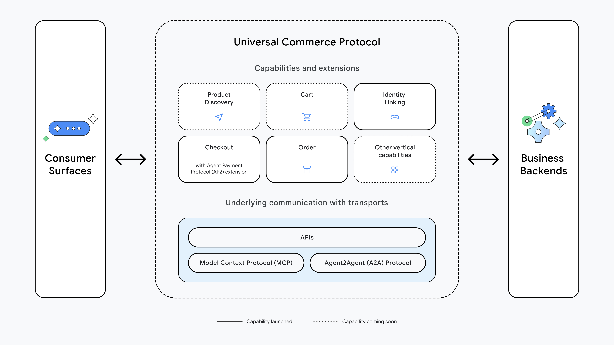

<!--
   Copyright 2026 UCP Authors

   Licensed under the Apache License, Version 2.0 (the "License");
   you may not use this file except in compliance with the License.
   You may obtain a copy of the License at

       http://www.apache.org/licenses/LICENSE-2.0

   Unless required by applicable law or agreed to in writing, software
   distributed under the License is distributed on an "AS IS" BASIS,
   WITHOUT WARRANTIES OR CONDITIONS OF ANY KIND, either express or implied.
   See the License for the specific language governing permissions and
   limitations under the License.
-->

# 핵심 개념

Universal Commerce Protocol(UCP)은 다양한 커머스 주체 간의
통신과 상호운용성을 촉진하기 위해 설계된 개방형 표준입니다.
소비자 접점/플랫폼, 비즈니스, 결제 제공자, 신원 제공자가
서로 다른 시스템 위에서 동작하는 파편화된 환경에서,
UCP는 표준화된 공통 언어와 기능 프리미티브를 제공합니다.

이 문서는 UCP에 대한 상세 기술 명세를 제공합니다.
모든 데이터 모델과 스키마의 전체 정의는
[스키마 레퍼런스](../specification/reference.md)를 참고하세요.

UCP의 주요 목표는 다음을 가능하게 하는 것입니다.

* **소비자 접점/플랫폼:** 비즈니스 capability를 발견하고 구매를 촉진할 수 있습니다.
* **비즈니스:** 모든 플랫폼마다 개별 커스텀 통합을 만들지 않고,
    재고와 리테일 로직을 표준 방식으로 노출할 수 있습니다.
* **결제 및 자격증명 제공자:** 거래를 촉진하기 위해 토큰과 자격증명을
    안전하게 교환할 수 있습니다.

## 상위 수준 아키텍처

<!-- Responsive image: shows ucp-diagram-mobile.jpg on small screens (<=600px)
     and ucp-diagram.jpg on larger screens. -->
<picture>
  <source media="(max-width: 600px)" srcset="../assets/ucp-diagram-mobile.png">
  
</picture>

## UCP의 핵심 목표

* **상호운용성(Interoperability):** 소비자 접점, 비즈니스,
    결제 생태계 간의 단절을 해소합니다.
* **Discovery:** 소비자 접점이 비즈니스 지원 항목을 동적으로 발견할 수 있도록 합니다
    (예: "게스트 체크아웃을 지원하는가?", "로열티 프로그램이 있는가?").
* **보안(Security):** 민감한 사용자/결제 데이터 교환 시
    안전하고 표준 기반(OAuth 2.0, PCI-DSS 준수 패턴)의 처리를 지원합니다.
* **에이전트 커머스(Agentic Commerce):** AI 에이전트가 사용자를 대신해
    "100달러 이하 헤드셋을 찾아 구매" 같은 복합 작업을 수행할 수 있게 합니다.

## 역할 및 참여자

UCP는 커머스 라이프사이클에서 각기 다른 역할을 수행하는
4개의 주요 행위자 간 상호작용을 정의합니다.

### 플랫폼(애플리케이션/에이전트)

플랫폼은 사용자 대신 동작하는 소비자 대면 인터페이스
(예: AI 에이전트, 모바일 앱, 소셜 미디어 사이트)입니다.
비즈니스를 발견하고 사용자 의도를 실현하면서 커머스 여정을 오케스트레이션합니다.

* **책임:** 프로필을 통한 비즈니스 capability 탐색,
    체크아웃 세션 시작, 사용자에게 UI 또는 대화형 인터페이스 제공.
* **예시:** AI 쇼핑 어시스턴트, 슈퍼앱, 검색 엔진.

### 비즈니스

상품이나 서비스를 판매하는 주체입니다.
UCP 모델에서 비즈니스는 **Merchant of Record (MoR)**로 동작하며,
주문에 대한 재무 책임과 소유권을 유지합니다.

* **책임:** 커머스 capability(재고, 가격, 세금 계산) 노출,
    주문 이행, 선택한 PSP를 통한 결제 처리.
* **예시:** 리테일러, 항공사, 호텔 체인, 서비스 제공자.

### 자격증명 제공자(Credential Provider, CP)

민감한 사용자 데이터(특히 결제 수단 및 배송 주소)를
안전하게 관리·공유하는 신뢰 주체입니다.

* **책임:** 사용자 인증, 결제 토큰 발급(플랫폼에서 원본 카드 데이터 제거),
    PII를 안전하게 보관해 타 참여자의 규제 준수 범위를 최소화.
* **예시:** 디지털 지갑(예: Google Wallet, Apple Pay), 신원 제공자.

### 결제 서비스 제공자(Payment Service Provider, PSP)

비즈니스를 대신해 결제를 처리하는 금융 인프라 제공자입니다.

* **책임:** 거래 승인 및 매입(capture), 정산 처리,
    카드 네트워크와의 통신. PSP는 자격증명 제공자가 제공한 토큰과
    직접 상호작용하는 경우가 많습니다.
* **예시:** Stripe, Adyen, PayPal, Braintree, Chase Paymentech.

## 핵심 개념 요약

UCP는 엔터티 간 상호작용 방식을 정의하는 3가지 기본 구성요소를 중심으로 동작합니다.

* **Capability:** 비즈니스가 지원하는 독립적인 핵심 기능입니다.
    프로토콜의 "동사"에 해당합니다.
    * *예시:* Checkout, Identity Linking, Order.
* **Extension:** `extends` 필드를 통해 다른 capability를 확장하는
    선택적 기능입니다. Extension은 핵심 capability와 함께
    `ucp.capabilities[]`에 나타납니다.
    * *예시:* Discounts(Checkout 확장), AP2 Mandates(Checkout 확장).
* **Service:** 데이터를 교환하는 하위 통신 계층입니다.
    UCP는 전송 방식에 종속되지 않지만, 상호운용성을 위해
    구체적인 바인딩을 정의합니다.
    * *예시:* REST API(기본), MCP(Model Context Protocol), A2A(Agent2Agent).
