---
hide:
  - toc
title: 유니버설 커머스 프로토콜
description: 플랫폼, 에이전트, 비즈니스를 위한 공통 언어.
image: assets/banner.png
---

<!--
   Copyright 2026 UCP Authors

   Licensed under the Apache License, Version 2.0 (the "License");
   you may not use this file except in compliance with the License.
   You may obtain a copy of the License at

       http://www.apache.org/licenses/LICENSE-2.0

   Unless required by applicable law or agreed to in writing, software
   distributed under the License is distributed on an "AS IS" BASIS,
   WITHOUT WARRANTIES OR CONDITIONS OF ANY KIND, either express or implied.
   See the License for the specific language governing permissions and
   limitations under the License.
-->

<div class="landing-page">
  <div class="hero-wrapper">
    <div class="hero-content">
      <h1>Universal Commerce<br>Protocol</h1>
      <p class="hero-subheading">
        플랫폼, 에이전트, 비즈니스를 위한 공통 언어.
      </p>
      <p class="hero-description">
        UCP는 탐색과 구매부터 구매 이후 경험까지 에이전트 커머스를 위한 구성 요소를 정의하여, 생태계가 개별 맞춤 통합 없이 하나의 표준으로 상호운용되도록 합니다.
      </p>
    </div>
    <div class="hero-image">
      
    </div>
  </div>

  <div class="promo-card-wrapper">

    <div class="promo-card">
      <h3>학습하기</h3>
      <p>프로토콜 개요, 핵심 개념, 설계 원칙</p>
      <a href="specification/overview/" class="promo-button">
        문서 보기
      </a>
    </div>

    <div class="promo-card">
      <h3>구현하기</h3>
      <p>GitHub 저장소, 기술 명세, SDK, 레퍼런스 구현</p>
      <a href="https://github.com/Universal-Commerce-Protocol/ucp"
         class="promo-button" target="_blank">
        GitHub에서 보기
      </a>
    </div>

  </div>

  <div class="partners-intro-wrapper">
    <h2>업계 리더들과 공동 개발 및 채택</h2>

    <p>
      UCP는 업계가 업계를 위해 만들었습니다. 장바구니 이탈과 사용자 불편을 유발하는 파편화된 커머스 여정을 해결하고, 에이전트 커머스를 가능하게 하기 위함입니다.
    </p>

    <div class="partners-logo-row">
      
      <span class="partners-logo-fallback">Google</span>

      
      <span class="partners-logo-fallback">Shopify</span>

      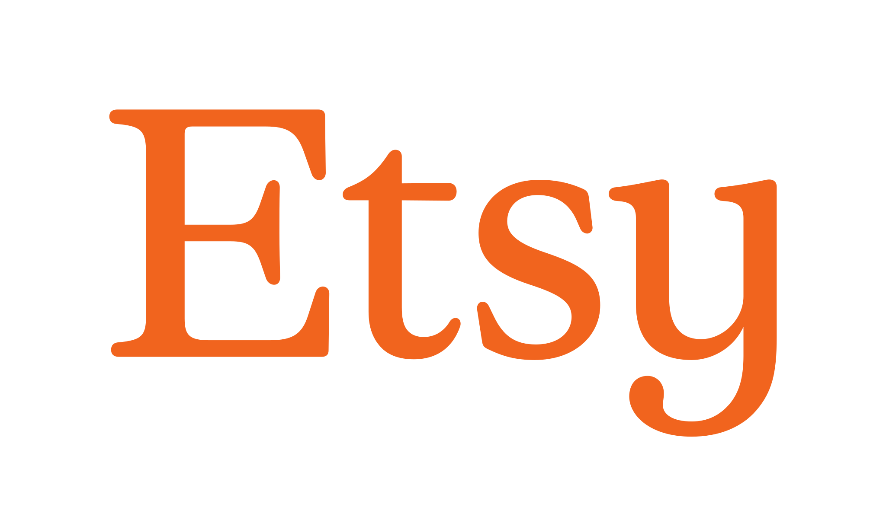
      <span class="partners-logo-fallback">Etsy</span>
    </div>

    <div class="partners-logo-row">
      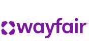
      <span class="partners-logo-fallback">Wayfair</span>

      
      <span class="partners-logo-fallback">Target</span>

      
      <span class="partners-logo-fallback">Walmart</span>

    </div>
  </div>

  <div class="flexibility-section">
    <h2>유연성, 보안, 확장성을 위한 설계</h2>
    <p>
      에이전트 커머스는 상호운용성을 요구합니다. UCP는 업계 표준인 REST 및 JSON-RPC 전송을 기반으로 구축되었고,
      <a href="https://ap2-protocol.org/" target="_blank">Agent Payments Protocol (AP2)</a>,
      <a href="https://a2a-protocol.org/latest/" target="_blank">Agent2Agent (A2A)</a>, 및
      <a href="https://modelcontextprotocol.io/docs/getting-started/intro" target="_blank">Model Context Protocol (MCP)</a>
      을 기본 지원하므로 서로 다른 시스템이 별도 커스텀 통합 없이 함께 동작할 수 있습니다.
    </p>
  </div>

  <div class="features-list">

    <div class="feature-item">
      <div class="feature-item-icon">
        
      </div>
      <div>
        <h3>확장 가능하고 범용적</h3>
        <p>
          어떤 커머스 주체(소상공인부터 엔터프라이즈까지)와 모든 상호작용 방식(채팅, 비주얼 커머스, 음성 등)을 지원하도록 확장 가능한 서피스 독립 설계입니다.
        </p>
      </div>
    </div>

    <div class="feature-item">
      <div class="feature-item-icon">
        
      </div>
      <div>
        <h3>비즈니스 중심 설계</h3>
        <p>
          커머스를 원활하게 지원하도록 설계되어, 리테일러가 비즈니스 규칙 통제권을 유지하고 고객 관계의 완전한 소유권을 가진 Merchant of Record로 남을 수 있습니다.
        </p>
      </div>
    </div>

    <div class="feature-item">
      <div class="feature-item-icon">
        
      </div>
      <div>
        <h3>개방형 및 확장형</h3>
        <p>
          설계 단계부터 개방성과 확장성을 갖추어, 다양한 산업 영역에서 커뮤니티 주도의 capability 및 extension 개발을 가능하게 합니다.
        </p>
      </div>
    </div>

    <div class="feature-item">
      <div class="feature-item-icon">
        
      </div>
      <div>
        <h3>안전하고 프라이버시 중심</h3>
        <p>
          계정 연동(OAuth 2.0)과 안전한 결제(AP2)를 위한 검증된 보안 표준(결제 mandate 및 검증 가능한 자격증명 기반) 위에 구축되었습니다.
        </p>
      </div>
    </div>

    <div class="feature-item">
      <div class="feature-item-icon">
        
      </div>
      <div>
        <h3>마찰 없는 결제</h3>
        <p>
          제공자 간 상호운용이 가능한 개방형 지갑 생태계를 통해 사용자가 선호하는 결제 수단으로 결제할 수 있게 합니다.
        </p>
      </div>
    </div>

  </div>

  <section class="action-carousel-section">
    <h2>동작 예시 보기</h2>
    <p>
      UCP는 초기 상품 탐색과 검색부터 최종 판매 및 구매 후 지원까지, 커머스 전체 라이프사이클을 지원하도록 설계되었습니다.
  프로토콜의 초기 릴리스는 Checkout, Identity Linking, Order Management의 세 가지 핵심 capability에 집중합니다.
    </p>
    <div class="carousel-tabs">
      <button class="tab-btn active" onclick="openTab(event, 'tab-checkout')">Checkout</button>
      <button class="tab-btn" onclick="openTab(event, 'tab-identity')">Identity Linking</button>
      <button class="tab-btn" onclick="openTab(event, 'tab-order')">Order</button>
    </div>

    <div class="carousel-content">
      <div id="tab-checkout" class="tab-pane active">
        <div class="pane-text">
          <div class="icon-placeholder">
            
          </div>
          <div class="pane-eyebrow">동작 예시</div>
          <h3>Checkout</h3>
          <p>통합 checkout 세션을 통해 수백만 비즈니스에 걸쳐 복잡한 cart 로직, 동적 가격, 세금 계산 등을 지원합니다.</p>
          <a href="specification/checkout-rest/" class="learn-more-btn">자세히 보기</a>
        </div>
        <div class="pane-visuals">
          <div class="image-container">
            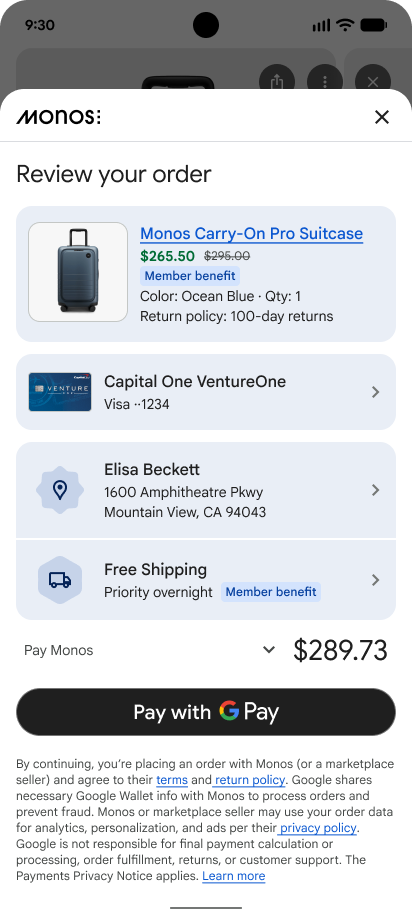
          </div>
          <div class="code-block-placeholder">

  ```json {.yaml .no-copy}
  {
    "ucp": { ... },
    "id": "chk_123456789",
    "status": "ready_for_complete",
    "currency": "USD",
    "buyer": {
      "email": "e.beckett@example.com",
      "first_name": "Elisa",
      "last_name": "Beckett"
    },
    "line_items": [
      {
        "id": "li_1",
        "item": {
          "id": "item_123",
          "title": "Monos Carry-On Pro suitcase",
          "price": 26550
        },
        "quantity": 1,
        ...
      }
    ],
    "totals": [ ... ],
    "links": [ ... ],
    "payment": { ... },
    "fulfillment": {
      "methods": [
        {
          "id": "method_1",
          "type": "shipping",
          "line_item_ids": ["li_1"],
          "selected_destination_id": "dest_1",
          "destinations": [
            {
              "id": "dest_1",
              "first_name": "Elisa",
              "last_name": "Beckett",
              "street_address": "1600 Amphitheatre Pkwy",
              "address_locality": "Mountain View",
              "address_region": "CA",
              "postal_code": "94043",
              "address_country": "US"
            }
          ],
          "groups": [
            {
              "id": "group_1",
              "line_item_ids": ["li_1"],
              "selected_option_id": "free-shipping",
              "options": [
                {
                  "id": "free-shipping",
                  "title": "Free Shipping",
                  "totals": [ {"type": "total", "amount": 0} ]
                }
              ]
            }
          ]
        }
      ]
    }
  }
  ```

          </div>
        </div>
      </div>
      <div id="tab-identity" class="tab-pane">
        <div class="pane-text">
          <div class="icon-placeholder">
            
          </div>
          <div class="pane-eyebrow">동작 예시</div>
          <h3>Identity Linking</h3>
          <p>OAuth 2.0 표준을 통해 에이전트는 자격증명을 공유하지 않고도 안전하고 권한이 부여된 관계를 유지할 수 있습니다.</p>
          <a href="specification/identity-linking/" class="learn-more-btn">자세히 보기</a>
        </div>
        <div class="pane-visuals">
          <div class="image-container">
            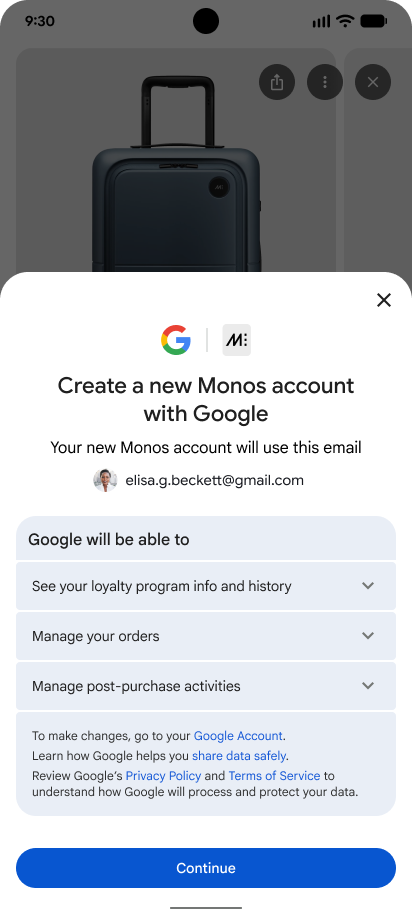
          </div>
          <div class="code-block-placeholder">

  ```json {.yaml .no-copy}
  Sample of /.well-known/oauth-authorization-server

  {
    "issuer": "https://example.com",
    "authorization_endpoint": "https://example.com/oauth2/authorize",
    "token_endpoint": "https://example.com/oauth2/token",
    "revocation_endpoint": "https://example.com/oauth2/revoke",
    "scopes_supported": [
      "ucp:scopes:checkout_session",
    ],
    "response_types_supported": [
      "code"
    ],
    "grant_types_supported": [
      "authorization_code",
      "refresh_token"
    ],
    "token_endpoint_auth_methods_supported": [
      "client_secret_basic"
    ],
    "service_documentation": "https://example.com/docs/oauth2"
  }
  ```

          </div>
        </div>
      </div>
      <div id="tab-order" class="tab-pane">
        <div class="pane-text">
            <div class="icon-placeholder">
              
          </div>
          <div class="pane-eyebrow">동작 예시</div>
          <h3>Order</h3>
          <p>구매 확정부터 배송까지. 실시간 webhook으로 상태 업데이트, 배송 추적, 반품 처리를 모든 채널에서 지원합니다.</p>
          <a href="specification/order/" class="learn-more-btn">자세히 보기</a>
        </div>
        <div class="pane-visuals">
          <div class="image-container">
            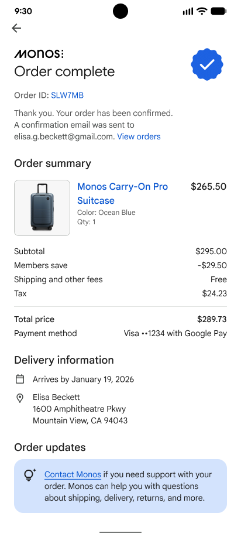
          </div>
          <div class="code-block-placeholder">

  ```json {.yaml .no-copy}
  {
    "ucp": { ... },
    "id": "order_123456789",
    "checkout_id": "chk_123456789",
    "permalink_url": ...,
    "line_items": [ ... ],
    "fulfillment": {
      "expectations": [
        {
          "id": "exp_1",
          "line_items": [{ "id": "li_1", "quantity": 1 }],
          "method_type": "shipping",
          "destination": {
            "first_name": "Elisa",
            "last_name": "Beckett",
            "street_address": "1600 Amphitheatre Pkwy",
            "address_locality": "Mountain View",
            "address_region": "CA",
            "postal_code": "94043",
            "address_country": "US"
          },
          "description": "Arrives in 2-3 business days",
          "fulfillable_on": "now"
        }
        ...
      ],
      "events": [
        {
          "id": "evt_1",
          "occurred_at": "2026-01-11T10:30:00Z",
          "type": "delivered",
          "line_items": [{ "id": "li_1", "quantity": 1 }],
          "tracking_number": "123456789",
          "tracking_url": "https://fedex.com/track/123456789",
          "description": "Delivered to front door"
        }
      ]
    },
    "adjustments": [
      {
        "id": "adj_1",
        "type": "refund",
        "occurred_at": "2026-01-12T14:30:00Z",
        "status": "completed",
        "line_items": [{ "id": "li_1", "quantity": 1 }],
        "amount": 26550,
        "description": "Defective item"
      }
    ],
    "totals": [ ... ]
  }
  ```

          </div>
        </div>
      </div>
    </div>
  </section>

  <script>
  function openTab(evt, tabName) {
    var i, tabContent, tabButtons;
    tabContent = document.getElementsByClassName("tab-pane");
    for (i = 0; i < tabContent.length; i++) {
      tabContent[i].classList.remove("active");
    }
    tabButtons = document.getElementsByClassName("tab-btn");
    for (i = 0; i < tabButtons.length; i++) {
      tabButtons[i].classList.remove("active");
    }
    document.getElementById(tabName).classList.add("active");
    evt.currentTarget.classList.add("active");
  }
  </script>

  <div class="two-column-promo">

    <div class="two-column-promo-item">
      <div class="two-column-promo-item-icon-wrapper">
        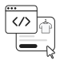
      </div>
      <h3>네이티브 checkout 구현</h3>
      <p>
        판매자의 checkout API와 직접 연동 및 협상하여, 플랫폼에 맞는 네이티브 UI와 워크플로를 구현할 수 있습니다.
      </p>
      <a href="specification/checkout-rest/" class="promo-button">작동 방식 보기</a>
    </div>

    <div class="two-column-promo-item">
      <div class="two-column-promo-item-icon-wrapper">
        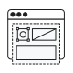
      </div>
      <h3>비즈니스 checkout 임베드</h3>
      <p>
        비즈니스 checkout UI를 임베드/렌더링하여, 양방향 통신, 결제 및 배송 주소 위임 같은 고급 capability가 필요한 복잡한 checkout 흐름을 지원합니다.
      </p>
      <a href="specification/embedded-checkout/" class="promo-button">자세히 보기</a>
    </div>

  </div>

  <div class="lifecycle-container">

    <h2>커머스 생태계 전체를 위한 설계</h2>

    <div class="lifecycle-container-row">
      <div class="lifecycle-container-item">
        <div class="lifecycle-container-item-img-wrapper">
          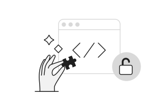
        </div>
        <h3>개발자용</h3>
        <p>
          개방형 기반 위에서 커머스의 미래를 구축하세요. 차세대 디지털 커머스를 위한 오픈소스 표준을 함께 발전시키는 커뮤니티에 참여하세요.
        </p>
        <a href="specification/overview/" class="lifecycle-container-item-link">기술 명세 보기</a>
      </div>
      <div class="lifecycle-container-item">
        <div class="lifecycle-container-item-img-wrapper">
          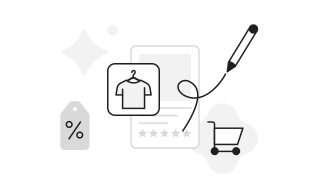
        </div>
        <h3>비즈니스용</h3>
        <p>
          UCP는 리테일러가 AI 어시스턴트, 쇼핑 에이전트, 임베디드 경험 등 어디서든 고객을 만날 수 있게 하며, 채널마다 checkout을 다시 만들 필요가 없습니다. Merchant of Record 지위와 비즈니스 로직을 그대로 유지할 수 있습니다.
        </p>
        <a href="https://developers.google.com/merchant/ucp/" target="_blank" class="lifecycle-container-item-link">UCP 연동하기</a>
      </div>
    </div>
    <div class="lifecycle-container-row">
      <div class="lifecycle-container-item">
        <div class="lifecycle-container-item-img-wrapper">
          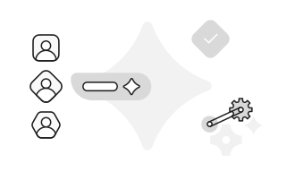
        </div>
        <h3>AI 플랫폼용</h3>
        <p>
          표준화된 API로 비즈니스 온보딩을 단순화하고, 사용자에게 통합 쇼핑 경험을 제공합니다. MCP, A2A, 기존 에이전트 프레임워크와 호환됩니다.
        </p>
        <a href="documentation/core-concepts/" class="lifecycle-container-item-link">UCP 핵심 개념 자세히 보기</a>
      </div>
      <div class="lifecycle-container-item">
        <div class="lifecycle-container-item-img-wrapper">
          
        </div>
        <h3>결제 제공자용</h3>
        <p>
          검증 가능한 유니버설 결제: 모든 승인은 사용자 동의의 암호학적 증명으로 뒷받침됩니다. 개방형 모듈식 payment handler 설계로 상호운용성과 결제수단 선택권을 보장합니다.
        </p>
        <a href="documentation/ucp-and-ap2/" class="lifecycle-container-item-link">UCP와 AP2 자세히 보기</a>
      </div>

    </div>
  </div>

  <div class="partner-carousel">
    <h2>생태계 전반의 지지</h2>

    <div class="partner-track">
      <div class="partner-logo">
        
        <span>Adyen</span>
      </div>
      <div class="partner-logo">
        
        <span>Affirm</span>
      </div>
      <div class="partner-logo">
        
        <span>Amex</span>
      </div>
      <div class="partner-logo">
        
        <span>Ant International</span>
      </div>
      <div class="partner-logo">
        
        <span>Best Buy</span>
      </div>
      <div class="partner-logo">
        
        <span>Block</span>
      </div>
      <div class="partner-logo">
        
        <span>Carrefour</span>
      </div>
      <div class="partner-logo">
        
        <span>Chewy</span>
      </div>
      <div class="partner-logo">
        
        <span>Commerce</span>
      </div>
      <div class="partner-logo">
        
        <span>Fiserv</span>
      </div>
      <div class="partner-logo">
        
        <span>Flipkart</span>
      </div>
      <div class="partner-logo">
        
        <span>Gap</span>
      </div>
      <div class="partner-logo">
        
        <span>Klarna</span>
      </div>
      <div class="partner-logo">
        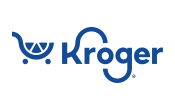
        <span>Kroger</span>
      </div>
      <div class="partner-logo">
        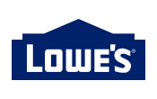
        <span>Lowe's</span>
      </div>
      <div class="partner-logo">
        
        <span>Macy's</span>
      </div>
      <div class="partner-logo">
        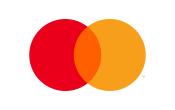
        <span>Mastercard</span>
      </div>
      <div class="partner-logo">
        
        <span>Paypal</span>
      </div>
      <div class="partner-logo">
        
        <span>Salesforce</span>
      </div>
      <div class="partner-logo">
        
        <span>Sephora</span>
      </div>
      <div class="partner-logo">
        
        <span>Shopee</span>
      </div>
      <div class="partner-logo">
        
        <span>Splitit</span>
      </div>
      <div class="partner-logo">
        
        <span>Stripe</span>
      </div>
      <div class="partner-logo">
        
        <span>The Home Depot</span>
      </div>
      <div class="partner-logo">
        
        <span>Ulta</span>
      </div>
      <div class="partner-logo">
        
        <span>Visa</span>
      </div>
      <div class="partner-logo">
        
        <span>Worldpay</span>
      </div>
      <div class="partner-logo">
        
        <span>Zalando</span>
      </div>
      <!-- Duplicated the partner logos to provide a seamless infinite scroll in the carousel-->
      <div class="partner-logo">
        
        <span>Adyen</span>
      </div>
     <div class="partner-logo">
        
        <span>Affirm</span>
      </div>
      <div class="partner-logo">
        
        <span>Amex</span>
      </div>
      <div class="partner-logo">
        
        <span>Ant International</span>
      </div>
      <div class="partner-logo">
        
        <span>Best Buy</span>
      </div>
      <div class="partner-logo">
        
        <span>Block</span>
      </div>
      <div class="partner-logo">
        
        <span>Carrefour</span>
      </div>
      <div class="partner-logo">
        
        <span>Chewy</span>
      </div>
      <div class="partner-logo">
        
        <span>Commerce</span>
      </div>
      <div class="partner-logo">
        
        <span>Fiserv</span>
      </div>
      <div class="partner-logo">
        
        <span>Flipkart</span>
      </div>
      <div class="partner-logo">
        
        <span>Gap</span>
      </div>
      <div class="partner-logo">
        
        <span>Klarna</span>
      </div>
      <div class="partner-logo">
        
        <span>Kroger</span>
      </div>
      <div class="partner-logo">
        
        <span>Lowe's</span>
      </div>
      <div class="partner-logo">
        
        <span>Macy's</span>
      </div>
      <div class="partner-logo">
        
        <span>Mastercard</span>
      </div>
      <div class="partner-logo">
        
        <span>Paypal</span>
      </div>
      <div class="partner-logo">
        
        <span>Salesforce</span>
      </div>
      <div class="partner-logo">
        
        <span>Sephora</span>
      </div>
      <div class="partner-logo">
        
        <span>Shopee</span>
      </div>
      <div class="partner-logo">
        
        <span>Splitit</span>
      </div>
      <div class="partner-logo">
        
        <span>Stripe</span>
      </div>
      <div class="partner-logo">
        
        <span>The Home Depot</span>
      </div>
      <div class="partner-logo">
        
        <span>Ulta</span>
      </div>
      <div class="partner-logo">
        
        <span>Visa</span>
      </div>
      <div class="partner-logo">
        
        <span>Worldpay</span>
      </div>
      <div class="partner-logo">
        
        <span>Zalando</span>
      </div>

    </div>
  </div>

  <div class="get-started-container">

    <div class="get-started-container-intro">
      <h2>지금 시작하세요</h2>

      <p>
        UCP는 AI 에이전트, 앱, 비즈니스, 결제 제공자가 연결마다 일회성 커스텀 통합 없이도 자연스럽게 상호작용할 수 있도록 설계된 개방형 표준입니다. 커머스의 미래를 함께 만들기 위해 여러분의 피드백과 기여를 기다립니다.
      </p>
      <p>
        전체 기술 명세, 문서, 레퍼런스 구현은 공개 GitHub 저장소에서 확인할 수 있습니다.
      </p>
    </div>

    <div class="get-started-container-steps">
      <div class="get-started-container-step">
        <div class="get-started-container-step-icon-wrapper">
          
        </div>
        <h3><a href="https://github.com/Universal-Commerce-Protocol/samples" target="_blank">다운로드</a></h3>
        <p>코드 샘플을 내려받아 실행해 보세요</p>
      </div>
      <div class="get-started-container-step">
        <div class="get-started-container-step-icon-wrapper">
          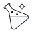
        </div>
        <h3><a href="https://ucp.dev/playground/" target="_blank">실험하기</a></h3>
        <p>프로토콜과 다양한 에이전트 역할을 직접 실험해 보세요</p>
      </div>
      <div class="get-started-container-step">
        <div class="get-started-container-step-icon-wrapper">
          
        </div>
        <h3><a href="https://github.com/Universal-Commerce-Protocol/ucp/blob/main/CONTRIBUTING.md" target="_blank">기여하기</a></h3>
        <p>공개 저장소에 피드백과 코드를 기여해 주세요</p>
      </div>
    </div>
    <div class="get-started-container-repo-link">
      <a href="https://github.com/Universal-Commerce-Protocol/ucp" target="_blank" class="promo-button">
        <svg height="24" width="24" viewBox="0 0 16 16" version="1.1" fill="currentColor">
          <path d="M8 0C3.58 0 0 3.58 0 8c0 3.54 2.29 6.53 5.47 7.59.4.07.55-.17.55-.38 0-.19-.01-.82-.01-1.49-2.01.37-2.53-.49-2.69-.94-.09-.23-.48-.94-.82-1.13-.28-.15-.68-.52-.01-.53.63-.01 1.08.58 1.23.82.72 1.21 1.87.87 2.33.66.07-.52.28-.87.51-1.07-1.78-.2-3.64-.89-3.64-3.95 0-.87.31-1.59.82-2.15-.08-.2-.36-1.02.08-2.12 0 0 .67-.21 2.2.82.64-.18 1.32-.27 2-.27.68 0 1.36.09 2 .27 1.53-1.04 2.2-.82 2.2-.82.44 1.1.16 1.92.08 2.12.51.56.82 1.27.82 2.15 0 3.07-1.87 3.75-3.65 3.95.29.25.54.73.54 1.48 0 1.07-.01 1.93-.01 2.2 0 .21.15.46.55.38A8.013 8.013 0 0016 8c0-4.42-3.58-8-8-8z"></path>
        </svg>
        GitHub 저장소 방문
      </a>
    </div>

  </div>
</div>
